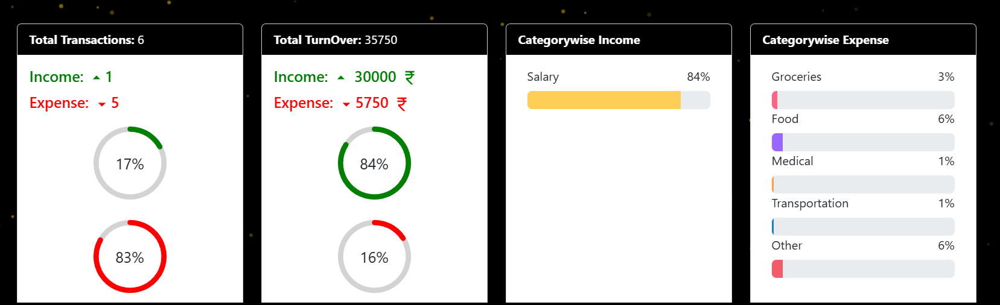
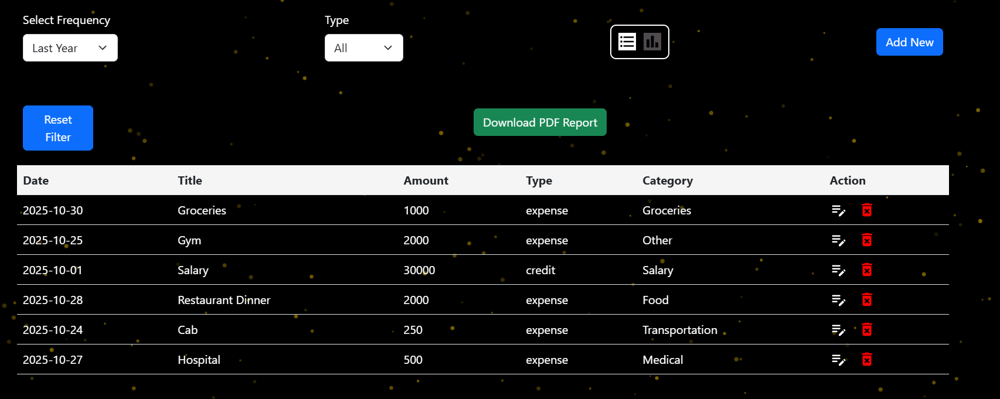

💰 Budget Buddy – Personal Finance & Expense Tracker (MERN Stack)
🌐 Live Website : https://budget-buddy-frontend-git-main-spartanopjods-projects.vercel.app/
💻 GitHub Repository: https://github.com/SpartanOpJod/Budget-Buddy
🧾 Project Description

Budget Buddy is a modern and user-friendly web application that helps individuals track, manage, and analyze their expenses efficiently.
Built using the MERN stack (MongoDB, Express.js, React.js, Node.js), this system offers secure authentication, insightful analytics, and a clean responsive interface — making financial management simple and accessible.

🎯 Objectives

Simplify the process of tracking daily income and expenses.
Provide users with insights through analytics and reports.
Offer easy-to-use features for adding, editing, and deleting transactions.
Enable PDF report generation for better record-keeping.
Deliver a smooth, responsive experience across all devices.

🚀 Features

🔐 User Authentication & Security
Secure registration and login using encrypted passwords.
Local session management using browser storage.

💸 Expense Management
Add, update, and delete transactions.
Categorize expenses (Food, Rent, Medical, Entertainment, etc.).
View expenses by date, category, or amount.

📊 Dashboard & Analytics
Visual representation of spending patterns.
Compare income vs. expenses through charts.
Generate PDF reports for financial summaries.

📱 Responsive UI
Built using React & Bootstrap.
Works smoothly on desktops, tablets, and smartphones.

🌟 Extra Pages
About, Contact, and Features pages for better navigation and presentation.
Contact page includes your personal LinkedIn for networking.

🧠 Tech Stack
Frontend: React.js, Bootstrap, React Router, tsparticles
Backend: Node.js, Express.js
Database: MongoDB (Mongoose ORM)
Authentication: bcrypt, JWT (optional upgrade)
Deployment: Vercel (Frontend), Render/MongoDB Atlas (Backend & DB)

⚙️ Setup & Installation
1️⃣ Clone the repository
git clone https://github.com/SpartanOpJod/Budget-Buddy.git

2️⃣ Install dependencies

Frontend:

cd frontend
npm install

Backend:

cd backend
npm install

3️⃣ Environment Variables

Inside backend/config/config.env add:

PORT=5001
MONGO_URI=mongodb://127.0.0.1:27017/expense-tracker
JWT_SECRET=your_secret_key

4️⃣ Run the project

Backend:

npm run dev

Frontend:

npm start

🧩 Folder Structure
Budget-Buddy/
│
├── frontend/        # React app
│   ├── src/
│   ├── public/
│   └── package.json
│
├── backend/         # Node + Express API
│   ├── models/
│   ├── controllers/
│   ├── routers/
│   └── package.json
│
└── README.md

🖼️ Screenshots

	
📬 Contact

👤 Developed by: Aryan Srivastava 

🔗 LinkedIn Profile:https://www.linkedin.com/in/aryan-srivastava-29a9a031a/

🌐 GitHub: https://github.com/SpartanOpJod
