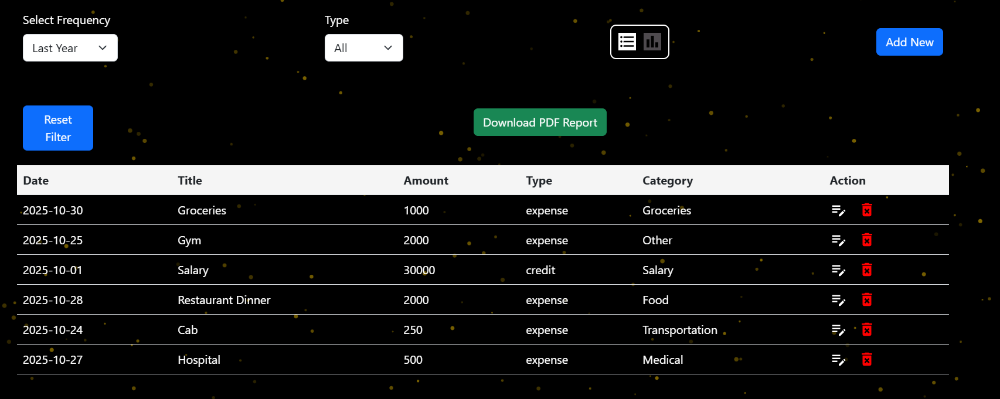
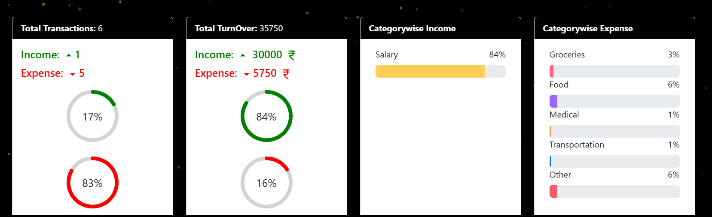
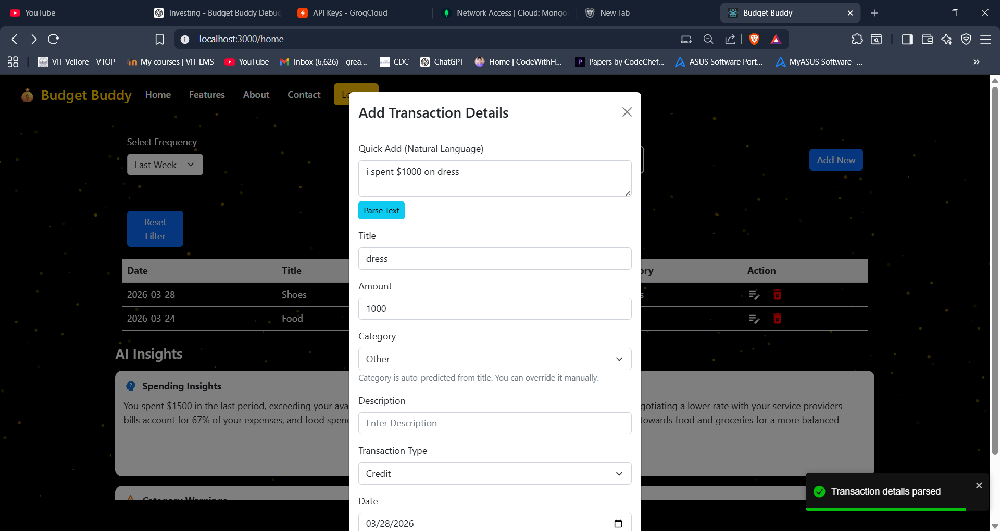
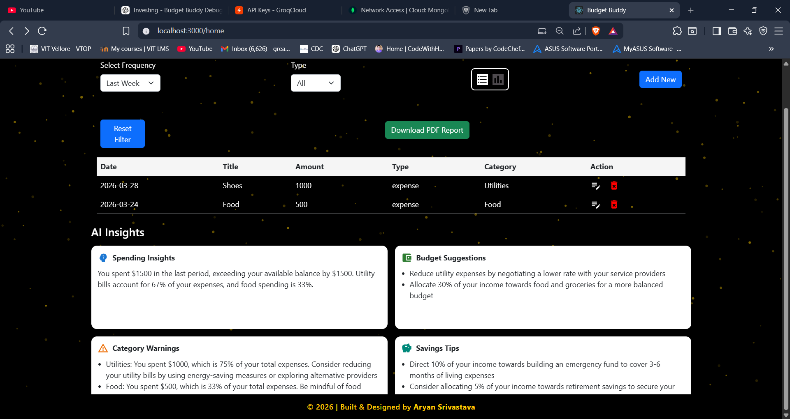

# Budget Buddy
### AI-Powered Personal Finance Assistant (MERN + Groq LLM)

Budget Buddy is a production-style personal finance platform that combines the reliability of the MERN stack with intelligent AI workflows to make money management faster, smarter, and more actionable.

## Live Demo & Repository
- **Live Demo:** https://budget-buddy-frontend-git-main-spartanopjods-projects.vercel.app/
- **GitHub:** https://github.com/SpartanOpJod/Budget-Buddy

## Overview
Most expense trackers require manual, repetitive data entry and provide limited guidance after the numbers are stored. Budget Buddy solves this by integrating Groq LLM capabilities directly into the finance workflow.

Users can log transactions through natural language, receive AI-generated financial guidance, and visualize spending patterns in an intuitive dashboard. The result is a practical, real-world personal finance assistant that helps users make better decisions in less time.

## Key Features
### AI Features :robot:
- **Natural Language Expense Parsing:** Convert text like `"spent 500 on food"` into structured transaction fields.
- **AI-Generated Financial Insights:** Receive spending analysis, budget suggestions, category warnings, and savings tips.
- **Smart AI Categorization:** Automatically predicts transaction categories from user input and titles.
- **Spending Trend Intelligence:** Uses historical transaction summaries for forward-looking spending context.

### Core Features :money_with_wings:
- Secure user authentication and protected routes.
- Add, edit, delete, and filter income/expense transactions.
- Date and frequency-based filtering for better control.
- Downloadable **PDF financial reports** for personal record-keeping.

### Analytics :chart_with_upwards_trend:
- Income vs expense breakdown.
- Category-wise spending and earnings visualization.
- Percentage-based turnover and transaction distribution insights.

### UI/UX :art:
- Clean, responsive dashboard optimized for desktop and mobile.
- Quick-add workflows for faster daily usage.
- Modern React-based interface focused on clarity and usability.

## Tech Stack :brain:
- **Frontend:** React.js, Bootstrap, Material UI, Axios, React Router
- **Backend:** Node.js, Express.js
- **Database:** MongoDB + Mongoose
- **AI Layer:** Groq SDK (`llama-3.1-8b-instant`)
- **Security & Middleware:** JWT, bcrypt, helmet, cors, morgan
- **Reporting:** jsPDF
- **Deployment:** Vercel (Frontend), MongoDB Atlas / compatible backend hosting

## Architecture / How It Works
1. User interacts with the React dashboard to add or review financial data.
2. Express APIs handle authentication, transactions, and AI endpoints.
3. MongoDB stores user profiles and transaction history.
4. Groq-powered services parse natural language, predict categories, and generate insights.
5. Analytics and reports are rendered in real time on the frontend.

## Setup & Installation :gear:
```bash
git clone https://github.com/SpartanOpJod/Budget-Buddy.git
cd Budget-Buddy
```

```bash
# Backend
cd backend
npm install
npm run dev
```

```bash
# Frontend (new terminal)
cd frontend
npm install
npm start
```

## Environment Variables :lock:
Create a `.env` file in each app directory and add the required keys.

**`backend/.env`**
```env
PORT=5001
MONGO_URI=your_mongodb_connection_string
JWT_SECRET=your_jwt_secret
GROQ_API_KEY=your_groq_api_key
FRONTEND_URL=http://localhost:3000
CORS_ORIGINS=http://localhost:3000
```

**`frontend/.env`**
```env
REACT_APP_API_URL=http://localhost:5001
```

Do not commit `.env` files or expose API keys.

## Screenshots :framed_picture:
### Dashboard


### Analytics


### Natural Language Parsing


### AI Insights


## Future Improvements :rocket:
- Multi-currency support and localized financial insights.
- Recurring expense detection and automated reminders.
- Personalized long-term savings goals with milestone tracking.
- Explainable AI recommendations with confidence indicators.

## Author / Contact :bust_in_silhouette:
**Aryan Srivastava**
- **LinkedIn:** https://www.linkedin.com/in/aryan-srivastava-29a9a031a/
- **GitHub:** https://github.com/SpartanOpJod
